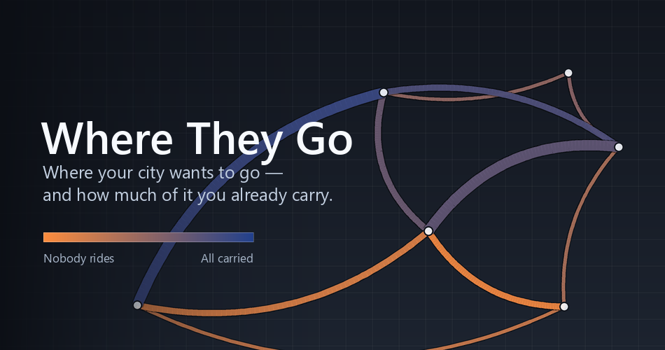

# Where They Go

A Cities: Skylines II mod that shows **where the people of your city want to go, and how
much of that your transit network already carries.** You build. It only ever tells you
what is there.

The game already knows every home, every workplace, every school and every errand its
citizens make, and gives you a utilisation percentage per line. This reads those journeys
out of your save and draws them.

<p align="center">
  
</p>

## What it is

One infoview, one section in the window of a line you click, and one in the window of a
building. It has no window of its own, adds no column to the transport overview, and
contains no button that changes your city.

The way in is a **button in the top-left row**, beside the other mods'. It hangs on
`GameTopLeft`, the hook the game provides for exactly that, so it occupies no surface a
large mod might want. The mod's entry in the infoview menu is hidden in exchange, so that
two doors do not lead into one room. If the button fails to register, the menu entry
stays and nothing is lost.

### Desire lines

Every journey the mod knows, drawn as a band between its two ends: home to work and home
to school out of the save, shopping and leisure from watching the city run.

- **Width** is how many journeys, in four classes, with a legend naming what each class
  means in journeys a day. They are classed rather than continuous because you can read a
  class off a single band, while a continuous ramp only means something next to the rest
  of the map.
- **Colour** is how much of that corridor your network already carries. Warm means your
  network does not carry those people. Cool means they are already on your metro.
  Journeys shorter than the walking horizon are left out of the bands and the figures,
  because they are walks: no line with an access walk at each end could ever carry them,
  and drawing them warm blamed the network for people on foot.
- **Bundling.** Journeys are summed per 256 m zone pair, and zone pairs whose ends lie
  close together fold into one band, heaviest corridor first. A slider in the panel hides
  the thin ones and says how many it hid.
- **Time of day.** The panel draws the city's day as twenty-four columns, each split into
  the part your network carries and the part it leaves to the road. Point at a column for
  its numbers. Click one and the map shows that hour, with an arrowhead on each band for
  which way the traffic runs. Press play and watch the day go by. A whole day has no
  direction to show, because every journey is made twice.
- **Purposes.** Work, school, shopping and leisure switch on and off separately, each
  carrying what it is worth. Switching one off takes its journeys out of the widths
  instead of hiding whole bands.
- **Point at a band** for a tooltip at the cursor with its numbers: journeys on it, how
  many of them travel without transit, its busiest hour, how far apart its ends are, and
  what those people are travelling for.

### Walk to transit

Every building is coloured by the walk from its door to the nearest stop a line actually
calls at. This is real walking time over the pedestrian network, not a circle drawn on the
map. The building's own window shows the number the colour came from.

### Two figures

- How much of the city's travel the network carries.
- How much of it has **both** ends within walking distance of a served stop.

Both say what they are made of, and you set the walking horizon.

Folded away underneath: the walk to a served stop in four classes, and the lines, served
stops and journeys a day that every other number in the panel is a share of. The classes
earn their place because "71 % within walking distance" leaves you unable to tell whether
the other 29 % are five minutes too far or have no stop at all.

### What a line does

Click a line and its window gains a reading rather than a verdict:

- how many journeys ride it, and how many passenger-minutes a day it saves them against
  walking and the rest of your network;
- how many of those journeys are **faster with it**, and how many take just as long
  without it. That second number answers "why is my line empty": there it runs beside
  something that already carries those people;
- where it stands among your lines, and what share of the city it carries;
- what it makes its riders wait, the busiest single reading it has had against its seats,
  and how long its round trip takes against the same trip in free flow;
- how full it runs hour by hour, from its own readings, drawn against its own busiest hour
  rather than against a full vehicle. Point at an hour for the number. An hour nobody
  watched stays a gap instead of becoming a zero;
- and the bands it carries light up on the map.

No advice on fleets, modes or timetables follows. Those are the game's to play.

## What it does not do

It does not suggest lines, place stops, choose modes, set vehicle counts, write
timetables, price tickets, or change anything at all about your city. Where another widely
used mod already does a job well, this one stays out of it. It hangs only on vanilla
surfaces that no large mod replaces: the top-left button row, the infoview panel, and the
window of the object you clicked.

## How it works

**The demand is real rather than modelled.** Citizens' households and workplaces are
entity references in the save, so home-to-work and home-to-school journeys are read out of
it. Shopping and leisure journeys cannot be, because the save holds only the journey
currently under way, so they are watched once a second from the live city and kept for
three game days along with the hour they happened at. There is no gravity model and no
calibration.

**Where a model is needed, the game's own is mirrored, and the mod says so.** Answering
"does the network carry this journey" needs routing over your lines, so the mod builds a
transit graph out of them, with stops, boarding points, rides, and walking links between
stops close enough to interchange. It then routes every journey door to door over that
graph, weighing walk, wait and ride the same and charging a change its walk and its wait,
because that is how the game's own pathfinder routes citizens. A journey counts as carried
when transit is **faster than walking the whole way** and stays under a ceiling drawn from
your city's own median carried journey. A journey that can be walked within the walking
horizon you set for "served" is a walk, not a transit question, and counts on neither
side. Mods that change pathfinding costs, such as Realistic PathFinding, are not modelled.

**A line's worth is measured by taking it away.** The two routed figures in a line's
window come from routing the whole city a second time without that line. Nothing is
attributed from inside a single search, since that kind of arithmetic hides its own
mistakes.

Everything heavy runs on a worker thread, and every number that reaches the panel also
reaches the log with the values it came from.

## Requirements

- Cities: Skylines II with the official modding toolchain installed, which sets
  `CSII_TOOLPATH` and `CSII_USERDATAPATH`
- .NET SDK

## Build

```powershell
./build.ps1            # Release
./build.ps1 -Configuration Debug
```

or `dotnet build dotnet/WhereTheyGo.csproj -c Release`. A `Makefile` wraps the awkward
parts; run `make` for the targets. Building also installs: the build copies itself into
the game's Mods folder, and the running game locks the deployed DLL, so close the game
first.

## Tests

```bash
dotnet run --project tests/WhereTheyGo.Tests
```

There are no packages to restore, and the exit code is the number of failures. Every
`Planning/` folder is free of Unity types so it can run outside the game, and the harness
links them all by glob: the bundling, the geometry, the routing, the walking-time search,
the window arithmetic and every numeric constant.

[CONTRIBUTING.md](CONTRIBUTING.md) covers the rest, including why CI cannot build the mod
half and what it checks instead.

## License

MIT. See [LICENSE](LICENSE).
